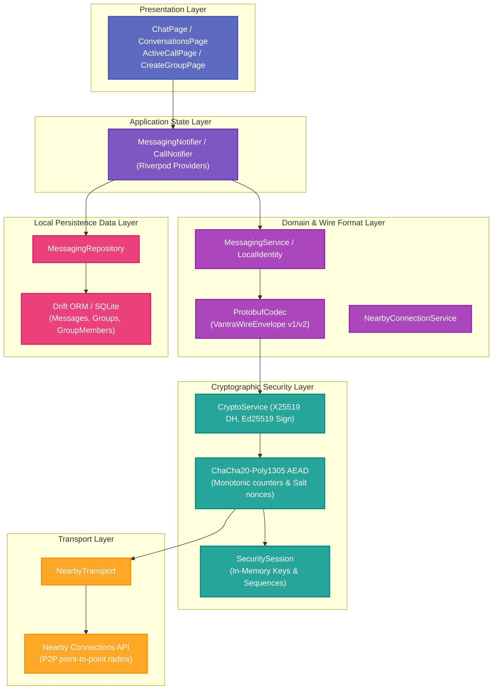
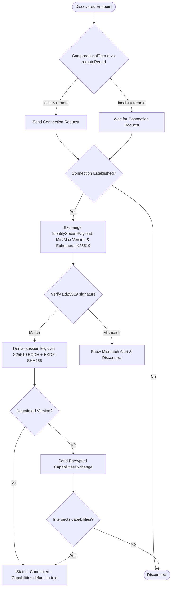
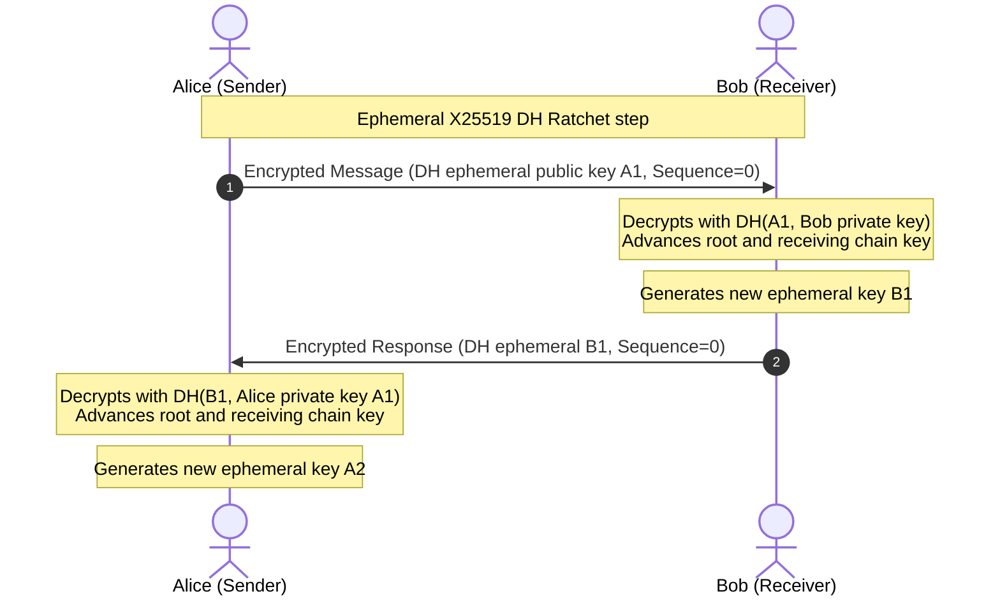
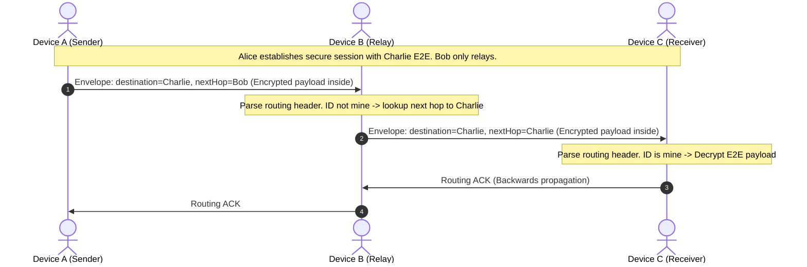
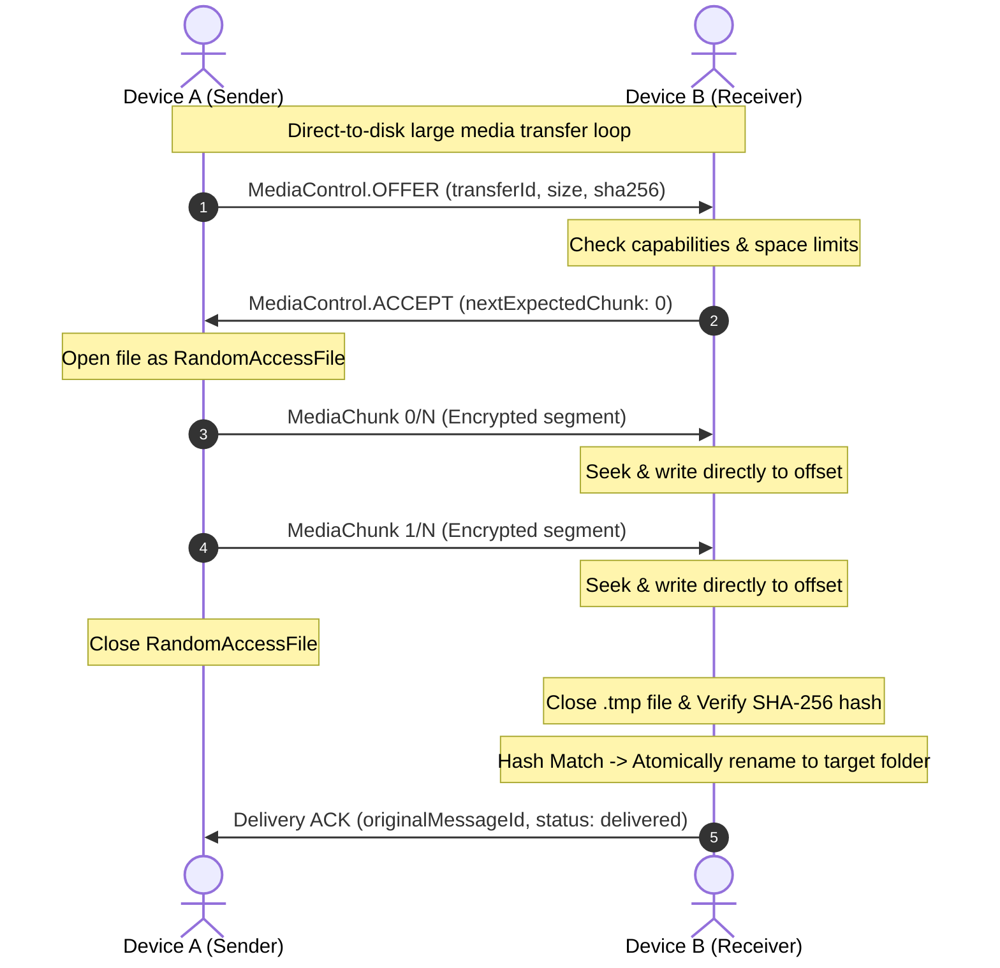
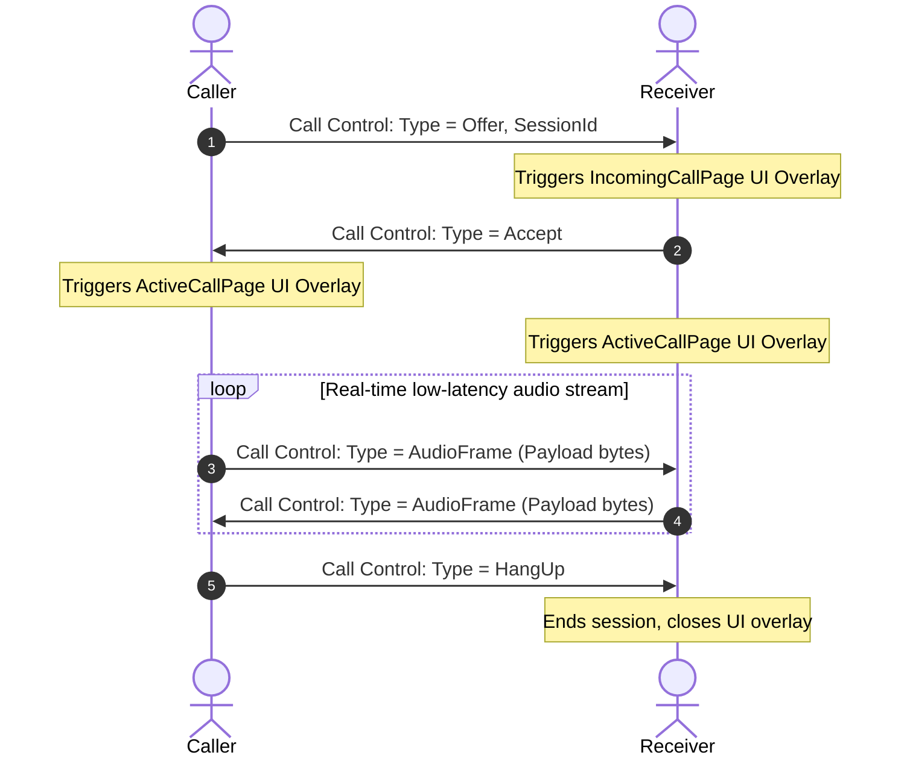
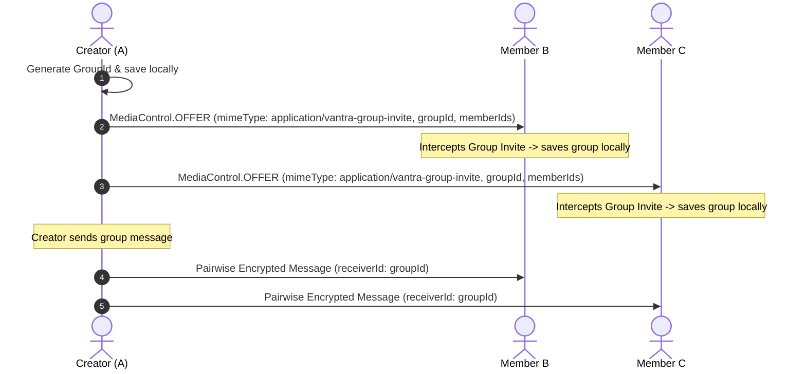

# VANTRA

> Where Devices Become the Network.

<p align="center">
  
</p>

VANTRA is a decentralized, offline-first peer-to-peer (P2P) communication platform designed to allow nearby Android devices to discover each other, establish secure connections, and exchange messages, real-time voice calls, and large media files without Internet or cellular networks.

---

## Why It Matters

In a world dependent on centralized internet service providers and cellular towers, communication is vulnerable to surveillance, outages, natural disasters, and censorship. VANTRA is designed to solve these issues:
- **Resilience:** Operates during grid failures, natural disasters, or in remote offline areas.
- **Privacy:** Eliminates central servers, metadata tracking, and third-party intermediaries.
- **Zero Cost:** Uses point-to-point Wi-Fi Direct and Bluetooth radios to transmit data locally at no cellular cost.

---

## Technical Requirements

### Supported Platforms
*   **Android:** Android 8.0 (API Level 26) or higher.
*   **Hardware Radios:** Wi-Fi (with Wi-Fi Direct support) and Bluetooth (supporting BLE).

### Core Permissions
To advertise, discover, establish connections, and support call/voice features offline, Vantra requests:
*   `ACCESS_FINE_LOCATION` / `ACCESS_COARSE_LOCATION` (Required for Bluetooth and Wi-Fi Direct discovery).
*   `NEARBY_WIFI_DEVICES` (Android 13+).
*   `BLUETOOTH_ADVERTISE`, `BLUETOOTH_CONNECT`, `BLUETOOTH_SCAN` (Android 12+).
*   `RECORD_AUDIO` (For voice recording and audio calling).
*   `READ_EXTERNAL_STORAGE` / `WRITE_EXTERNAL_STORAGE` (For direct-to-disk media streaming).

---

## Core System Features

### 1. Direct P2P Connectivity & Autoreconnection
*   Uses Google Nearby Connections (P2P_CLUSTER strategy) combining Bluetooth Low Energy (BLE) for high-speed discovery and Wi-Fi Direct for high-bandwidth data transfers.
*   Background auto-advertising and auto-discovery, allowing trusted peers to auto-reconnect and re-establish secure channels when in radio range.

### 2. Cryptographic Security & Ephemeral Exchange
*   **Cryptographic Identity:** Every device generates a persistent Ed25519 identity keypair.
*   **Double Ratchet Protocol:** Signal-style per-message forward secrecy and post-compromise security using root, sending, and receiving KDF chains.
*   **Session Handshake:** Diffie-Hellman ephemeral exchange (X25519) combined with Ed25519 signatures to derive unique session keys and prevent Man-in-the-Middle (MITM) attacks.
*   **AEAD Encryption:** Secure payload encryption using ChaCha20-Poly1305.

### 3. Multi-Hop Mesh Routing (A ── B ── C)
*   **Reactive Route Discovery:** Lightweight AODV-style path requests (RREQ) and route replies (RREP) to discover and route envelopes to non-adjacent peers.
*   **Dynamic Failure Recovery:** Backwards Route Error (RERR) propagation when intermediate links break, triggering source-level path invalidation and rediscovery.
*   **Reliable Relaying:** Deduplication filters to ignore already-forwarded packet IDs, hop-level retry queues, and multi-hop routing ACKs.

### 4. Direct-to-Disk Large Media Streaming
*   Handles large transfers (up to 500 MB) with a bounded memory footprint (constant memory usage <= 1 MB).
*   Dynamic chunking (e.g., 64 KB or 128 KB blocks) and direct RandomAccessFile stream-writing to prevent RAM congestion.
*   **SHA-256 Verification:** Verifies file hashes on completion before renaming temporary blocks, ensuring data integrity.
*   **UX Indicators:** Displays ETA, average speeds using moving window averages, progress bars, and retry/cancel actions.

### 5. Group Messaging Protocol
*   **Schema-Safe Groups:** Local SQLite representation using Drift DAOs (`Groups` and `GroupMembers` tables) maintaining synchronized membership states.
*   **Pairwise Fan-out:** Group messages are encrypted pairwise using each member's double-ratchet session and delivered over direct or mesh routes.
*   **Interception Envelopes:** Group invite offers (`application/vantra-group-invite`) are dynamically intercepted and processed in the background.

### 6. Voice Messages & Audio Calls
*   **Voice Recorder Widget:** Visual audio amplitude waves, dynamic recording timers, and intuitive slide-to-cancel gestures.
*   **Low-Latency Call Streaming:** Encrypted real-time audio frame chunks (`AudioFrame`) bypassed SQLite to prevent event loop bottlenecks.
*   **State Machine:** Interactive overlays (`IncomingCallPage` and `ActiveCallPage`) coordinating mute, speaker, call timer, and hang-up control signaling.

---

## Tech Stack

| Layer | Technology | Description |
|---|---|---|
| **Framework** | Flutter & Dart | Cross-platform runtime and UI shell |
| **State Management** | Riverpod | Reactive state management and dependency injection |
| **Local Database** | Drift (SQLite) | Persistent schema-safe offline storage |
| **Transport Protocol** | Google Nearby Connections | Bluetooth and Wi-Fi Direct point-to-point radios |
| **Serialization** | Protocol Buffers (Protobuf) | Compact binary wire framing and serialization |
| **Identity & Exchange** | Ed25519 & X25519 | Cryptographic identities and ephemeral key exchange |
| **Cipher AEAD** | ChaCha20-Poly1305 | Authenticated encryption with Associated Data (AAD) binding |
| **Real-time Audio** | audioplayers & record | Voice message recording, playback, and low-latency audio streaming |

---

## System Architecture

VANTRA features a highly decoupled, layered architecture to isolate presentation, application state, domain protocols, cryptographic security, and transport layers:



---

## Detailed Feature Workflows

### 1. Connection & Secure Session Handshake
This flowchart illustrates the discovery suffix resolution, role negotiation, ephemeral cryptographic exchange, and capabilities handshake:



### 2. Signal Double Ratchet Session Key Rotation
Every roundtrip of communication updates the session keys using root, sending, and receiving key derivation chains:



### 3. Multi-Hop Mesh Message Relaying (A ── B ── C)
Alice sends a message to Charlie who is out of range, relaying the encrypted envelope through Bob:



### 4. Direct-to-Disk Media Chunk Streaming
Pipes data directly from/to the filesystem during sending and receiving, keeping memory consumption low:



### 5. Audio Call Signaling & low-latency streaming
Low-latency real-time voice call setup, active session UI synchronizations, and frame transmission:



### 6. Group Creation, Invitation & Message Fan-out
Creates a decentralized group, invites members over direct or multi-hop routes, and distributes group messages:



---

## Phase Status

*   **Current Phase:** Phase 23: Android Background & Lifecycle
*   **Completed Phases:**
    *   **Phase 0:** Scaffold Foundation & Project Setup
    *   **Phase 1:** Direct P2P Connectivity & Raw Byte Transfer (Nearby Connections)
    *   **Phase 2:** Persistent Peer Identity & Text Messaging Core
    *   **Phase 3:** Offline-First SQLite Local Messaging Persistence (Drift SQLite)
    *   **Phase 4:** Secure Handshake, Ephemeral Key Exchange (X25519) & Cryptographic Signature Verification (Ed25519)
    *   **Phase 5:** Protobuf Wire Serialization & Encrypted ACK Protocol
    *   **Phase 6:** Peer Discovery, Contacts Book, Trust Management & Peer Blocking
    *   **Phase 7:** Persistent Outgoing Queue, Duplicate-Message ACK Recovery, and Crash Resiliency
    *   **Phase 8:** Production Connection Lifecycle & App Entry Experience
    *   **Phase 9:** Production UI/UX Polish & Dedicated Android Launcher Icons
    *   **Phase 10:** Persistent Trusted Peer Auto-Reconnection & Cryptographic Mismatch Warnings
    *   **Phase 11:** Protocol V2 Version Negotiation & Async Capability-Based Exchange
    *   **Phase 12:** Vantra V2 Core Image/File Transfer Protocol (OFFER/ACCEPT control messages)
    *   **Phase 13:** Generalized File Transfer Engine, SQLite Schema Migration, & SHA-256 Hash Verification
    *   **Phase 14:** Capability-Based Connection Recovery Protection & Physical Device Stabilization
    *   **Phase 15:** Memory-Bounded File Chunking & Performance Optimization
    *   **Phase 16:** Real Mesh Routing (A -> B -> C) & Route Table Schema
    *   **Phase 17:** Mesh Reliability, RERR Route Invalidation & Hop-Level Retries
    *   **Phase 18:** Large Media Streaming (Direct to Disk), sliding window validation, & fallback chunk sizing
    *   **Phase 19:** Media Transfer Progress UI (ETA, Speeds, Retry/Cancel)
    *   **Phase 20:** Voice Messages (Dynamic record timers, play/pause state bubbles, level indicators)
    *   **Phase 21:** Audio Calls (Equalizer waveform overlays, Speaker/Mute/Hangup signaling controls, status machines)
    *   **Phase 22:** Group Messaging (Pairwise Double-Ratchet message distribution, synchronized group lists, invite interception)

---

## Database Schema Layout (Drift SQLite)

```
┌────────────────────────────────────────────────────────┐
│                        messages                        │
├────────────────────────────────────────────────────────┤
│ localId (Int, PK, AutoInc)                             │
│ messageId (Text, Unique)                               │
│ senderId (Text)                                        │
│ receiverId (Text)                                      │
│ text (Text)                                            │
│ timestamp (Int)                                        │
│ type (Text)                                            │
│ status (Text)                                          │
│ isRead (Bool)                                          │
│ mediaPath, mimeType, fileName, fileSize (Nullable)     │
│ transferId, sha256, duration, groupId (Nullable)       │
└────────────────────────────────────────────────────────┘
                           │
                           ▼ (groupId maps to Groups)
┌────────────────────────────────────────────────────────┐
│                         groups                         │
├────────────────────────────────────────────────────────┤
│ groupId (Text, PK)                                     │
│ name (Text)                                            │
│ creatorId (Text)                                       │
│ createdAt (Int)                                        │
└────────────────────────────────────────────────────────┘
                           │
                           ▼
┌────────────────────────────────────────────────────────┐
│                     group_members                      │
├────────────────────────────────────────────────────────┤
│ groupId (Text)                                         │
│ peerId (Text)                                          │
└────────────────────────────────────────────────────────┘
```

---

## Testing & Verification

Vantra includes a highly comprehensive suite of over 190 tests covering all security, routing, calling, media streaming, and persistence layers.

### Run the Full Test Suite
To verify all components locally, execute:
```bash
flutter test
```

### Run Specific Test Modules
*   **Mesh Multi-Hop Features:**
    ```bash
    flutter test test/mesh_features_test.dart
    ```
*   **Audio Call Signaling:**
    ```bash
    flutter test test/call_signaling_test.dart
    ```
*   **Group messaging:**
    ```bash
    flutter test test/group_messaging_test.dart
    ```
*   **Media Streaming:**
    ```bash
    flutter test test/media_streaming_test.dart
    ```
