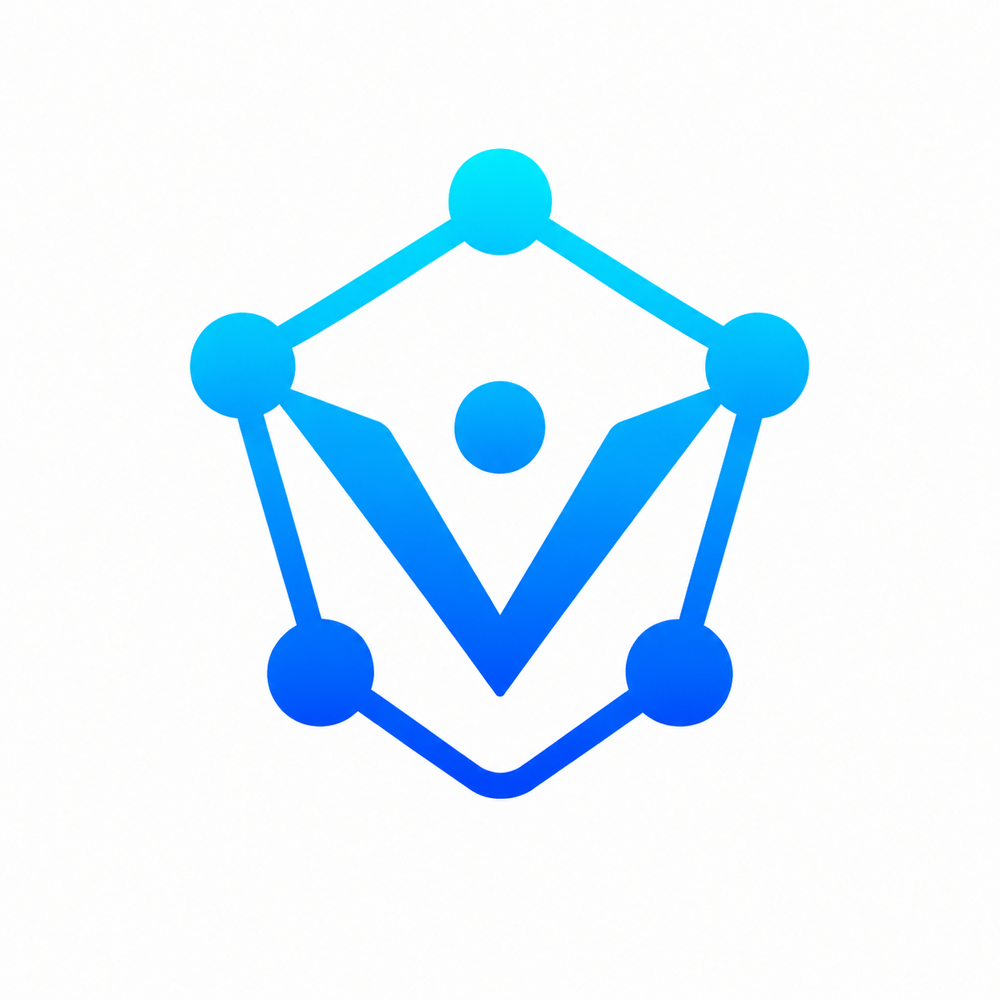
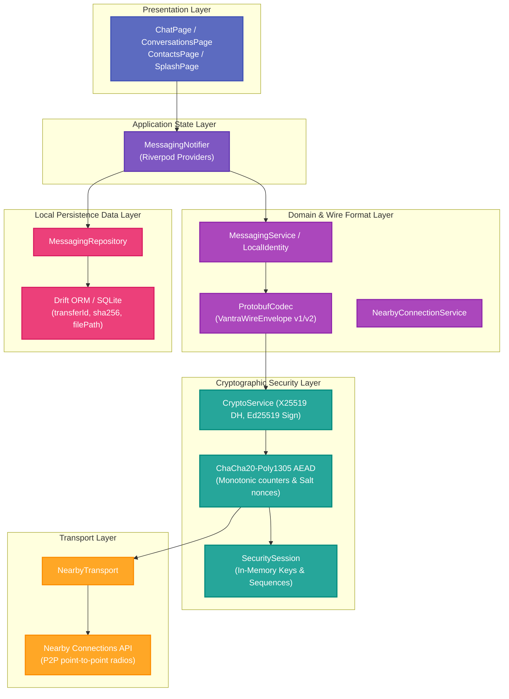
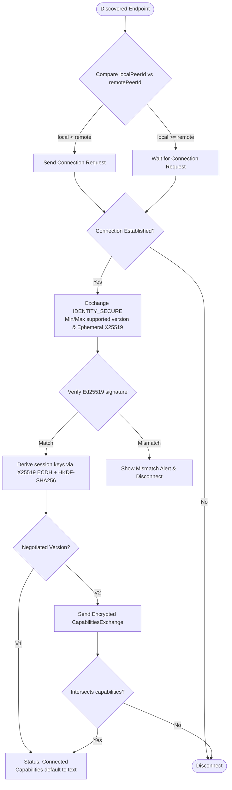
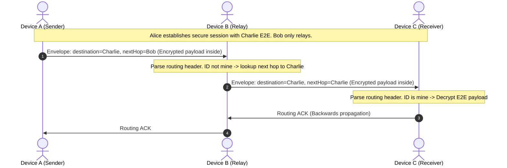
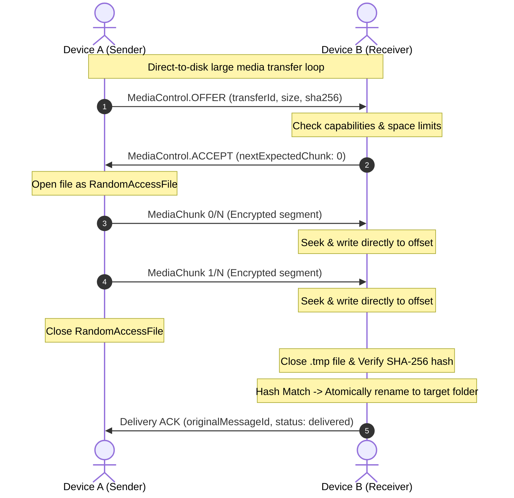

# VANTRA

> Where Devices Become the Network.

VANTRA is a decentralized, offline-first peer-to-peer (P2P) communication platform designed to allow nearby Android devices to discover each other, establish secure connections, and exchange messages and large media files without Internet or cellular networks.

---

## Why It Matters

In a world dependent on centralized internet service providers and cellular towers, communication is vulnerable to surveillance, outages, natural disasters, and censorship. VANTRA is designed to solve these issues:
- **Resilience:** Operates during grid failures, natural disasters, or in remote offline areas.
- **Privacy:** Eliminates central servers, metadata tracking, and third-party intermediaries.
- **Zero Cost:** Uses point-to-point Wi-Fi Direct and Bluetooth radios to transmit data locally at no cellular cost.

---

## Solution

VANTRA implements a robust multi-hop mesh network:
- **Zero-Config Discovery:** Nearby devices automatically find each other and establish local connection topologies.
- **End-to-End Cryptography:** Handshakes verify identity and establish session keys, ensuring confidentiality, integrity, and forward secrecy.
- **Multi-Hop Mesh Routing:** Packets are automatically relayed via intermediate nodes, allowing end-to-end delivery between devices out of physical radio range.
- **Direct-to-Disk Media Streaming:** Supports transferring large files (up to 500 MB) with a bounded memory footprint.

---

## Tech Stack

| Layer | Technology | Description |
|---|---|---|
| **Framework** | Flutter & Dart | Cross-platform runtime and UI shell |
| **State Management** | Riverpod | Reactive state management and dependency injection |
| **Local Database** | Drift (SQLite) | Persistent schema-safe offline storage |
| **Transport Protocol** | Google Nearby Connections | Bluetooth and Wi-Fi Direct point-to-point radios |
| **Serialization** | Protocol Buffers (Protobuf) | Compact binary wire framing and serialization |
| **Identity & Exchange** | Ed25519 & X25519 | Cryptographic identities and ephemeral key exchange |
| **Cipher AEAD** | ChaCha20-Poly1305 | Authenticated encryption with Associated Data (AAD) binding |

---

## Architecture

VANTRA features a highly decoupled, layered architecture to isolate presentation, application state, domain protocols, cryptographic security, and transport layers:

---

## Flowchart: Connection & Secure Session Handshake

---

## Workflow: E2E Mesh Relaying & Large Media Streaming

### Mesh Message Relaying (A -> B -> C)

### Direct-to-Disk Media Streaming (V2)

---

## Phase Status

*   **Current Phase:** Phase 19: Media Transfer Progress UI
*   **Completed Phases:**
    *   **Phase 0:** Scaffold Foundation & Project Setup
    *   **Phase 1:** Direct P2P Connectivity & Raw Byte Transfer (Nearby Connections)
    *   **Phase 2:** Persistent Peer Identity & Text Messaging Core
    *   **Phase 3:** Offline-First SQLite Local Messaging Persistence (Drift SQLite)
    *   **Phase 4:** Secure Handshake, Ephemeral Key Exchange (X25519) & Cryptographic Signature Verification (Ed25519)
    *   **Phase 5:** Protobuf Wire Serialization & Encrypted ACK Protocol
    *   **Phase 6:** Peer Discovery, Contacts Book, Trust Management & Peer Blocking
    *   **Phase 7:** Persistent Outgoing Queue, Duplicate-Message ACK Recovery, and Crash Resiliency
    *   **Phase 8:** Production Connection Lifecycle & App Entry Experience
    *   **Phase 9:** Production UI/UX Polish & Dedicated Android Launcher Icons
    *   **Phase 10:** Persistent Trusted Peer Auto-Reconnection & Cryptographic Mismatch Warnings
    *   **Phase 11:** Protocol V2 Version Negotiation & Async Capability-Based Exchange
    *   **Phase 12:** Vantra V2 Core Image/File Transfer Protocol (OFFER/ACCEPT control messages)
    *   **Phase 13:** Generalized File Transfer Engine, SQLite Schema Migration, & SHA-256 Hash Verification
    *   **Phase 14:** Capability-Based Connection Recovery Protection & Physical Device Stabilization
    *   **Phase 15:** Memory-Bounded File Chunking & Performance Optimization
    *   **Phase 16:** Real Mesh Routing (A -> B -> C) & Route Table Schema
    *   **Phase 17:** Mesh Reliability, RERR Route Invalidation & Hop-Level Retries
    *   **Phase 18:** Large Media Streaming (Direct to Disk), sliding window validation, & fallback chunk sizing
