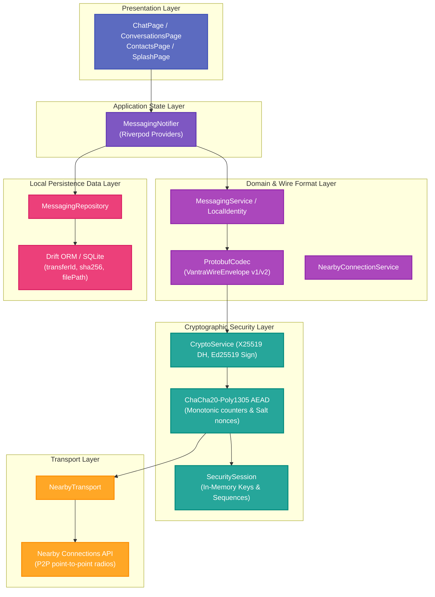
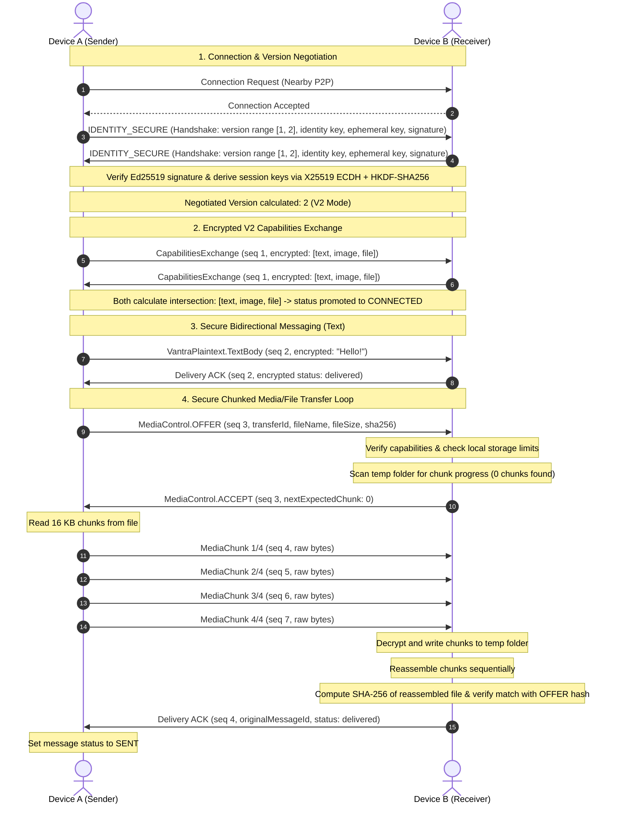

# VANTRA

> Where Devices Become the Network.

VANTRA is a decentralized, offline-first peer-to-peer communication platform designed to allow nearby Android devices to discover each other, establish secure connections, and exchange messages without Internet or cellular networks.

## Phase Status

*   **Current Phase:** Phase 14
*   **Status:** Secure chunked media/file transfer protocol, capabilities-based version negotiation, connection recovery protection, and SQLite reassembly engine completed.

## Completed Core Phases

*   **Phase 0:** Scaffold Foundation & Project Setup
*   **Phase 1:** Direct P2P Connectivity & Raw Byte Transfer (Nearby Connections)
*   **Phase 2:** Persistent Peer Identity & Text Messaging Core
*   **Phase 3:** Offline-First SQLite Local Messaging Persistence (Drift SQLite)
*   **Phase 4:** Secure Handshake, Ephemeral Key Exchange (X25519) & Cryptographic Signature Verification (Ed25519)
*   **Phase 5:** Protobuf Wire Serialization & Encrypted ACK Protocol
*   **Phase 6:** Peer Discovery, Contacts Book, Trust Management & Peer Blocking
*   **Phase 7:** Persistent Outgoing Queue, Duplicate-Message ACK Recovery, and Crash Resiliency
*   **Phase 8:** Production Connection Lifecycle & App Entry Experience
*   **Phase 9:** Production UI/UX Polish & Dedicated Android Launcher Icons
*   **Phase 10:** Persistent Trusted Peer Auto-Reconnection & Cryptographic Mismatch Warnings
*   **Phase 11:** Protocol V2 Version Negotiation & Async Capability-Based Exchange
*   **Phase 12:** Vantra V2 Core Image/File Transfer Protocol (OFFER/ACCEPT control messages)
*   **Phase 13:** Generalized File Transfer Engine, SQLite Schema Migration, & SHA-256 Hash Verification
*   **Phase 14:** Capability-Based Connection Recovery Protection & Physical Device Stabilization

## Architecture Overview

VANTRA features a highly decoupled, layered architecture to isolate presentation widgets, Riverpod state notifiers, domain-level wire formatting (Protobuf), cryptographic security operations, and offline transports:

### Architectural Layer Diagram (Phase 14)

### Protocol & Media Transfer Workflow (V2)

The sequential workflow of connection establishment, cryptographic handshake, version range negotiation, capability exchange, and chunked media transfer is illustrated below:

See the documentation in `docs/` for specific specifications:
*   [Architecture Guide](docs/architecture.md)
*   [Protocol Spec](docs/protocol.md)
*   [Security Architecture](docs/security.md)
*   [Networking Specs](docs/networking.md)
*   [Testing Guidelines](docs/testing.md)
