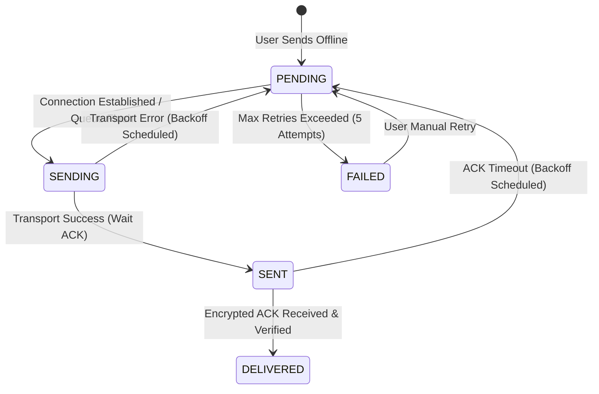

# VANTRA — Phase 7: Offline Messaging, Retry & Reconnection Reliability

This document outlines the detailed architecture, database schemas, state machines, and implementation details for Phase 7. The focus of this phase is to ensure messages can be sent offline, queued persistently, retried automatically upon reconnection, and recover gracefully from app restarts, all while strictly preserving VANTRA's cryptographic security invariants.

---

## 1. Audit Findings & Current Limitations

During the audit of Phases 1-6, the following characteristics and limitations were identified:

1. **Message Lifecycle**:
   - Outgoing messages immediately require a `connected` and `isSecure` session. If either is missing, `sendTextMessage` fails synchronously.
   - On transport failure, the status is updated to `MessageStatus.failed` in SQLite, but no retry is attempted.
   - Outgoing messages start as `MessageStatus.pending`, transition to `MessageStatus.sent` on successful transport transmission, and transition to `MessageStatus.delivered` only upon receiving a decrypted delivery ACK.
   
2. **Connection & Session Lifecycle**:
   - Connection updates from `Transport.connectionUpdateStream` trigger a secure handshake (`IDENTITY_SECURE`).
   - On disconnect, the corresponding `SecuritySession` is purged from memory (`_securitySessions.remove(peerId)`), destroying the session keys.
   - The session must be fully re-established (with fresh ephemeral keys and signatures) when the devices reconnect.

3. **Reconnection & Queuing**:
   - Currently, there is no persistent outgoing message queue. Pending or failed messages do not survive process restarts in a retryable state.
   - When a peer reconnects under a new Nearby `endpointId`, the mapping `endpointToPeerId` is updated. However, the system does not flush queued messages for that `peerId`.

4. **Security Invariants**:
   - Every session uses unique keys derived via X25519 and HKDF.
   - Replay protection operates on sequence numbers within a specific `sessionId`.

---

## 2. Proposed Architecture & Design

### A. Database Enhancements (Drift Schema Version 4)
To persistently track queue metadata and retry states without losing messages on crash or restart, we will add the following columns to the `Messages` table:
- **`retryCount`**: `IntColumn get retryCount => integer().withDefault(const Constant(0))();`
- **`lastAttempt`**: `IntColumn get lastAttempt => integer().nullable()();`

#### Migration Strategy
We will increment `schemaVersion` to `4` in `lib/core/database/app_database.dart` and add columns to the `onUpgrade` step:
```dart
if (from < 4) {
  await m.addColumn(messages, messages.retryCount);
  await m.addColumn(messages, messages.lastAttempt);
}
```

---

### B. Explicit Message State Machine
The messaging state transitions are defined by the following diagram:



#### State Definitions & UI Representation:
- **`PENDING`** (Queued / Offline): Stored locally, waiting for connection or backoff. Represented by a clock/queued icon.
- **`SENDING`** (Sending): In-flight state while encryption or transport write is active. Represented by a circular progress indicator.
- **`SENT`** (Sent): Successfully written to transport layer, waiting for ACK. Represented by a single checkmark.
- **`DELIVERED`** (Delivered): Encrypted ACK received and verified. Represented by a double checkmark.
- **`FAILED`** (Failed): Permanent failure after max retries exceeded. Represented by an error icon with tap-to-retry action.

---

### C. Retry Strategy & Explicit Limits
- **Maximum Retries**: `5` attempts.
- **Exponential Backoff**: Backoff interval increases with each attempt, defined as:
  - Attempt 1: 2 seconds
  - Attempt 2: 4 seconds
  - Attempt 3: 8 seconds
  - Attempt 4: 16 seconds
  - Attempt 5: 32 seconds
- **Jitter**: A random variation of $\pm 10\%$ is applied to each backoff interval to prevent network collision.
- **Retransmission Payload Identity**: Retransmissions MUST use the original `messageId` to ensure the receiver identifies the duplicate. However, they must be encrypted with the **new active session keys**, using the **new session ID**, **new sequence number** (incremented from the active session), and a **new random nonce**. This prevents replay attacks, key reuse, and keystream reuse.

---

### D. Reconnection & Persistent ACK-Timeout Recovery
- **Disconnect Detection**: On transport disconnect or heartbeat timeout, `SecuritySession` is destroyed.
- **Persistent ACK-Timeout Recovery**: Outgoing messages in the `SENT` state (where transport write succeeded but no ACK was received) are recovered when the app restarts or a session is re-established. They transition back to `PENDING` and are scheduled for retransmission in FIFO order.
- **Queue Flushing Order**: FIFO (First-In, First-Out) based on `timestamp` / `localId` ascending.
- **Worker Lock**: A sequential worker lock per `peerId` ensures that only one message is sent at a time, preserving FIFO order.

---

### E. Lost-ACK + Duplicate-Message ACK Recovery
If a message is successfully received and saved by the recipient, but the return ACK is lost:
1. The sender will retry the message (using the original `messageId` but encrypted under a new session/sequence/nonce).
2. When the recipient receives a message with an already existing `messageId`:
   - It performs a database check: `final existing = await repo.getMessage(messageId)`.
   - If the message already exists in SQLite, the recipient **discards the duplicate message** (does not insert a duplicate row, does not notify UI conversation streams).
   - The recipient **must immediately encrypt and send back another delivery ACK** for that `messageId` using the current active session keys. This ensures the sender eventually marks the message as `delivered` and stops retrying.

---

### F. Crash-Window Handling
- **Crash after SQLite Insert but before transport send**:
  - The message remains `PENDING` in SQLite and is cleanly picked up on the next app boot.
- **Crash after `Transport.send()` but before status is updated to `SENT`**:
  - On restart, the status is still `PENDING`. It will be retransmitted. The recipient's duplicate-message ACK recovery prevents duplicate rows while ensuring an ACK is sent.
- **Crash after receiving ACK but before status is updated to `DELIVERED`**:
  - On restart, the status is `SENT`. It will be retried, triggering the recipient to send back another ACK, resolving the state to `DELIVERED`.

---

### G. Security Invariants Checklist
- **Session Isolation**: Old session keys are never used. Every retry uses keys derived from the *active* session.
- **Encryption & Authentication**: AAD for Poly1305 remains bound to the message ID. ACKs are fully encrypted and authenticated under the active session keys.
- **Distrusted Peers**: Distrusted/blocked peers are immediately disconnected during handshake, preventing queue flushing.

---

## 3. File-by-File Modifications

### 1. `lib/core/database/tables/messages.dart`
- Add `retryCount` and `lastAttempt` columns.
- Update `MessagesCompanion` helper methods.

### 2. `lib/core/database/app_database.dart`
- Increment `schemaVersion` to `4`.
- Update `onUpgrade` migration strategy.

### 3. `lib/core/messaging/messaging_repository.dart`
- Add `getPendingMessages(String peerId)`: Queries messages where `senderId = local` and `receiverId = peerId` and `status = pending` ordered by `localId` ascending.
- Add `incrementRetry(String messageId)`: Atomically increments `retryCount` and sets `lastAttempt` timestamp.

### 4. `lib/core/messaging/messaging_provider.dart`
- Implement sequential queue worker with concurrency protection (active flushes map).
- Automatically trigger queue flush on session transition to `isSecure: true`.
- On startup, scan database for any pending/failed messages and attempt delivery for connected peers.
- Handle duplicate message prevention and return ACK transmission.

### 5. `lib/features/messaging/chat_page.dart`
- Map `MessageStatus.pending` to custom UI indicator: show a clock/queued icon if offline or backoff is active; show progress indicator if sending.
- Allow manual retry on `failed` messages by tapping them.

---

## 4. Testing & Verification Plan

### Automated Test Cases:
1. **Queue Survival Test**: Store pending message, restart provider container (mocking app restart), assert message is loaded and retryable.
2. **FIFO Order Test**: Queue 3 offline messages, connect peer, verify they are transmitted to transport in chronological order.
3. **Symmetric Retry/ACK Test**: Simulate lost ACK, verify message retransmission uses new sequence number and new session keys, and assert receiver ignores duplicate message row but sends back ACK.
4. **Distrusted Queue Block Test**: Queue messages, block peer, trigger reconnection, verify no payloads are sent.

### Physical Device Verification Procedure:
1. **Device A & B** connect and verify secure session.
2. **Device B** disables Wi-Fi/Bluetooth (goes offline).
3. **Device A** sends three messages: "One", "Two", "Three".
4. Verify **Device A** shows "Queued/Offline" status icons.
5. **Device B** enables Wi-Fi/Bluetooth.
6. Verify auto-connection completes, secure session is re-established, and all three messages arrive on **Device B**.
7. Verify status on **Device A** transitions to "Delivered" for all three messages.

---

PHASE 7 PLAN READY FOR REVIEW — NO SOURCE CODE MODIFIED.
